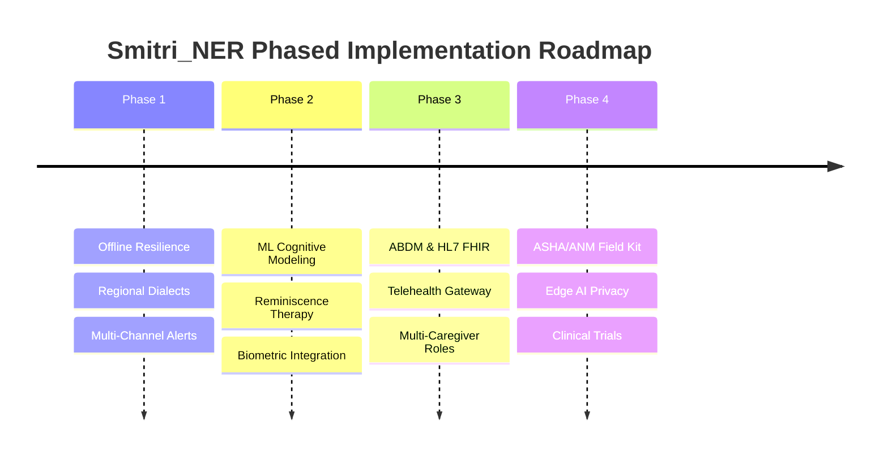

# Smitri_NER

**AI-Based Cognitive Gaming and Memory Assistance Platform for Elderly People**  
*Tailored for rural and remote communities in the North Eastern Region (NER) and beyond.*

---

## 1. Overview

**Smitri_NER** is a fully functional web MVP designed to provide accessible cognitive stimulation, memory assistance, daily routine adherence, and caregiver peace-of-mind.

The application adheres to senior-first accessibility principles:
- High contrast, large legible typography, and generous touch targets.
- Zero complicated menus or nested navigations.
- Native **Web Speech API** integration for reading instructions aloud and speech command recognition.
- Transparent rule-based cognitive scoring and adaptive difficulty engine.
- Persistent local SQLite/JSON data storage with 7-day trend metrics and sustained decline detection for caregivers.
- 1-Touch emergency contacts with direct cellular `tel:` dialer links.

> [!NOTE]
> **Prototype Disclaimer**: All scores generated by this platform are prototype cognitive wellness performance scores designed for engagement and memory exercises. They do not constitute a medical diagnosis, clinical evaluation, or dementia detector.

---

## 2. Core Implemented Features

| Feature | Description | Route / Component |
| :--- | :--- | :--- |
| **Floating Rounded Header** | Responsive navbar with brand logo, smooth navigation, quick SOS button, and mobile drawer | [`Navbar.tsx`](file:///c:/Users/ABHI%20SHARMA/OneDrive/Desktop/smitri/components/Navbar.tsx) |
| **Landing Hero** | "Brighter Minds, Healthier Tomorrows" with pill badge, video demo modal, and 3 benefit highlights | [`/`](file:///c:/Users/ABHI%20SHARMA/OneDrive/Desktop/smitri/app/page.tsx) |
| **Senior Dashboard** | Displays Today's Cognitive Score, Completed Exercises, Next Reminder, 7-Day Trend Chart, and Voice Summary | [`/dashboard`](file:///c:/Users/ABHI%20SHARMA/OneDrive/Desktop/smitri/app/dashboard/page.tsx) |
| **Cognitive Games Hub** | Access to 9 senior-friendly games with audio instructions and adaptive difficulty | [`/games`](file:///c:/Users/ABHI%20SHARMA/OneDrive/Desktop/smitri/app/games/page.tsx) |
| **1. Memory Match** | Card pair matching with response timer, mistake count, and adaptive grid sizing | [`/games/memory-match`](file:///c:/Users/ABHI%20SHARMA/OneDrive/Desktop/smitri/app/games/[gameId]/page.tsx) |
| **2. Sequence Memory** | Simon-says light recall puzzle with color flash sequence and pattern reproduction | [`/games/sequence-memory`](file:///c:/Users/ABHI%20SHARMA/OneDrive/Desktop/smitri/app/games/[gameId]/page.tsx) |
| **3. Find Different One** | Visual attention odd-one-out selection across 3 progressive rounds | [`/games/different-one`](file:///c:/Users/ABHI%20SHARMA/OneDrive/Desktop/smitri/app/games/[gameId]/page.tsx) |
| **4. Grocery Basket** | Short-term verbal & episodic recall of daily market shopping items | [`/games/grocery-basket`](file:///c:/Users/ABHI%20SHARMA/OneDrive/Desktop/smitri/app/games/[gameId]/page.tsx) |
| **5. Number Trail** | Trail Making Test (TMT) inspired sequential number stepping in ascending order | [`/games/number-trail`](file:///c:/Users/ABHI%20SHARMA/OneDrive/Desktop/smitri/app/games/[gameId]/page.tsx) |
| **6. Matrix Pattern Recall** | Spatial working memory grid recall of illuminated matrix tiles | [`/games/pattern-match`](file:///c:/Users/ABHI%20SHARMA/OneDrive/Desktop/smitri/app/games/[gameId]/page.tsx) |
| **7. Word & Sound Match** | Auditory & semantic association connecting spoken audio cues to visual concepts | [`/games/sound-word-match`](file:///c:/Users/ABHI%20SHARMA/OneDrive/Desktop/smitri/app/games/[gameId]/page.tsx) |
| **8. Clock Face Match** | Visuospatial orientation and daily routine analog clock reading | [`/games/clock-reading`](file:///c:/Users/ABHI%20SHARMA/OneDrive/Desktop/smitri/app/games/[gameId]/page.tsx) |
| **9. Rhyme & Proverb Complete** | Linguistic fluency and semantic memory retrieval through classic comforting phrases | [`/games/rhyme-completion`](file:///c:/Users/ABHI%20SHARMA/OneDrive/Desktop/smitri/app/games/[gameId]/page.tsx) |
| **Performance Engine** | Rule-based scoring: 50% accuracy + 30% speed + 20% completion (0-100 scale) | [`scoring.ts`](file:///c:/Users/ABHI%20SHARMA/OneDrive/Desktop/smitri/lib/scoring.ts) |
| **Adaptive Difficulty** | Dynamic recalibration (Levels 1-3) with supportive, non-pressuring voice feedback | [`/results`](file:///c:/Users/ABHI%20SHARMA/OneDrive/Desktop/smitri/app/results/page.tsx) |
| **Daily Reminders** | Medicine, water, exercise, and doctor appointments checklist with modal addition | [`/reminders`](file:///c:/Users/ABHI%20SHARMA/OneDrive/Desktop/smitri/app/reminders/page.tsx) |
| **Progress & History** | 7-day and 30-day interactive charts comparing score, accuracy, and response time | [`/progress`](file:///c:/Users/ABHI%20SHARMA/OneDrive/Desktop/smitri/app/progress/page.tsx) |
| **Caregiver Portal** | Real-time surveillance panel with sustained decline alerts ("Attention Required: Performance change detected") | [`/caregiver`](file:///c:/Users/ABHI%20SHARMA/OneDrive/Desktop/smitri/app/caregiver/page.tsx) |
| **Healthcare Ready** | Conceptual schema preview for future ABDM / HL7 FHIR telehealth exchange | [`/caregiver`](file:///c:/Users/ABHI%20SHARMA/OneDrive/Desktop/smitri/app/caregiver/page.tsx) |
| **Emergency Support** | High-visibility 1-touch dial for caregiver (Rahul) or National Helpline (112) | [`/emergency`](file:///c:/Users/ABHI%20SHARMA/OneDrive/Desktop/smitri/app/emergency/page.tsx) |
| **Profile & Settings** | Editable user name, age, caregiver contact, language, and secure storage notice | [`/profile`](file:///c:/Users/ABHI%20SHARMA/OneDrive/Desktop/smitri/app/profile/page.tsx) |
| **Prototype Auth** | Login & Register pages with 1-click Demo Account access for Kamla Devi (Age 68) | [`/login`](file:///c:/Users/ABHI%20SHARMA/OneDrive/Desktop/smitri/app/login/page.tsx) |

---

## 3. Technology Stack

- **Framework**: Next.js 14 (App Router)
- **Language**: TypeScript
- **Styling**: Tailwind CSS with Senior Accessibility design tokens
- **Icons**: Lucide React
- **Charts**: Recharts (Line Charts for 7-day & 30-day trajectories)
- **Speech API**: Web Speech API (`SpeechSynthesis` + `SpeechRecognition`)
- **Persistence**: SQLite-compatible JSON store (`data/smriti_store.json`) with automated seeding of 7-day history for demo user *Kamla Devi*.

---

## 4. Getting Started Locally

### Prerequisites
- Node.js (v18 or higher)
- npm

### Installation & Run

1. Clone or navigate to the repository directory:
   ```bash
   cd smitri
   ```
2. Install dependencies:
   ```bash
   npm install
   ```
3. Start development server:
   ```bash
   npm run dev
   ```
   Or run the production build:
   ```bash
   npm run build
   npm run start
   ```
4. Open your browser and visit:
   ```text
   http://localhost:3000
   ```

---

## 5. Demo Accounts

For hackathon reviews and instant demonstrations, demo data is pre-seeded:
- **Elderly User**: Kamla Devi, Age 68
- **Email**: `kamla.devi@example.com`
- **Caregiver / Emergency Contact**: Rahul (`+91 98765 43210`)
- **Quick Access**: Tap **"Enter as Demo User"** on the `/login` screen to immediately access pre-loaded historical data.

---

## 6. Future Implementation Plan (Phased Roadmap)

The long-term development of **Smitri_NER** is structured into 4 sequential phases tailored for elderly care, clinical efficacy, and the geographic nuances of the North Eastern Region.



### Phase 1: Near-Term Enhancements & Offline Resilience (Months 1–3)
- **Progressive Web App (PWA) & Offline-First Sync**:
  - Implement Service Workers with Cache API and local IndexedDB storage.
  - Enable 100% offline gameplay, local scoring, and reminder schedules for remote rural pockets with intermittent cellular connectivity.
  - Auto-synchronize batched telemetry when an internet connection is re-established.
- **Regional Languages & Dialects (NER Focus)**:
  - Add native audio and visual prompt localization for Assamese, Bengali, Bodo, Meitei (Manipuri), Mizo, Khasi, Garo, and Hindi.
  - Replace generic synthesized browser voices with pre-recorded natural dialect narrations from native speakers.
- **Multi-Channel Alert Dispatch**:
  - Integrate SMS and WhatsApp fallback notifications (Twilio / Gupshup) for caregivers when daily medicines or check-ins remain unacknowledged.

### Phase 2: Advanced AI & Reminiscence Therapy (Months 4–6)
- **ML-Powered Cognitive Trajectory Modeling**:
  - Migrate heuristic scoring to supervised machine learning models trained alongside standard Mini-Mental State Examination (MMSE) and Montreal Cognitive Assessment (MoCA) rubrics.
  - Detect micro-fluctuations in motor reaction time, touch jitter, and hesitation curves to catch subtle early signs of cognitive decline.
- **Personalized Reminiscence & Cultural Memory Games**:
  - Introduce photo-based family memory games (identifying grandchildren, family milestones).
  - Add regional folklore, classical melodies, and traditional cultural landmarks tailored to the user's community.
- **Biometric & Wearable Sensor Fusion**:
  - Connect with Bluetooth Low Energy (BLE) pulse oximeters, smart bands, and sleep monitors to cross-correlate physical vitals (sleep disruption, heart rate variability) with cognitive scores.

### Phase 3: Healthcare System Integration & ABDM Compliance (Months 7–9)
- **Ayushman Bharat Digital Mission (ABDM) Integration**:
  - Implement ABHA (Ayushman Bharat Health Account) creation and linking.
  - Integrate with the ABDM Health Information Exchange & Consent Manager (HIECM) to allow seniors and legal guardians to share longitudinal cognitive reports with verified physicians.
- **HL7 FHIR Clinical Data Exchange**:
  - Transform stored session history into production-ready FHIR `Observation`, `DiagnosticReport`, and `CarePlan` bundles.
  - Enable direct data interoperability with District Hospitals and Primary Health Centres (PHCs).
- **Teleconsultation & Tele-Geriatrics Gateway**:
  - Integrated 1-touch video consults connecting rural seniors and their families directly to regional geriatricians, clinical psychologists, and community health centers.

### Phase 4: Community Scale, Field Deployment & Validation (Months 10–12)
- **Community Health Worker (ASHA / ANM) Field Screening Mode**:
  - Specialized multi-patient kiosk mode on tablets allowing ASHA and ANM workers to administer rapid 5-minute cognitive wellness screenings during village health visits.
- **Privacy-Preserving On-Device Edge AI**:
  - Deploy quantized on-device neural networks (TensorFlow.js / ONNX Runtime Web) to keep sensitive cognitive health data strictly on the user's device in compliance with India's Digital Personal Data Protection Act (DPDPA 2023).
- **Clinical Validation & Longitudinal Field Trials**:
  - Form clinical research partnerships with premier regional healthcare institutions (e.g., NEIGRIHMS Shillong, AIIMS Guwahati) to clinically calibrate platform efficacy over 6- to 12-month cohort studies.

---

## 7. Known Limitations & Current Constraints

1. **Web Speech API**: In environments without microphone permissions or browsers with strict audio autoplay restrictions, graceful text fallbacks are shown.
2. **Current Persistence**: Currently stores state locally on the Node server JSON store; full client-side PWA offline caching is scheduled for Phase 1.
3. **ABDM / HL7 FHIR Gateway**: Currently represented as a standardized interoperability schema preview for integration with government digital health ecosystems.